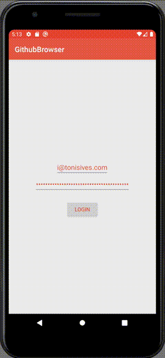

# Github Browser

This is the sample project for the [Android App Architecture](http://tonisives.com/2020/04/28/android-app-architecture-part-1/) blog post.

It follows the [Android app architecture guidelines](https://developer.android.com/jetpack/docs/guide) 
by implementing login and browsing of repositories via Github API.

Its purpose is to be a skeleton app when starting a new project.

# Table of contents

* [Requirements](#requirements)
* [Setup](#setup)
* [Architecture Components](#architecture)
* [Test coverage](#testcoverage)
* [Licence](#Licence)

### Requirements

* Android 5.0 Lollipop or higher.
* Android Studio 3.5 

### Setup

* Create a GitHub personal access token with at least repo read access [here](https://github.com/settings/tokens/) 
* Run LoginActivity.kt
* Enter your username and personal access token to see the repo list.

### Architecture Components

* **MVVM pattern**: ViewModels are used from androidx lifecycle packages. View reads LiveData from the ViewModel.
* **Koin dependency injection**
* **Room database**
* **Volley network client**

### Test coverage

* Instrumentation tests using MockWebServer assure that login and repo list views will be visible to the user.
* Unit tests test that repositories read, fetch and store data.

#### Run tests
`./gradlew test && ./gradlew cAT`

### Contributing

Please make a pull request

### License

MIT
